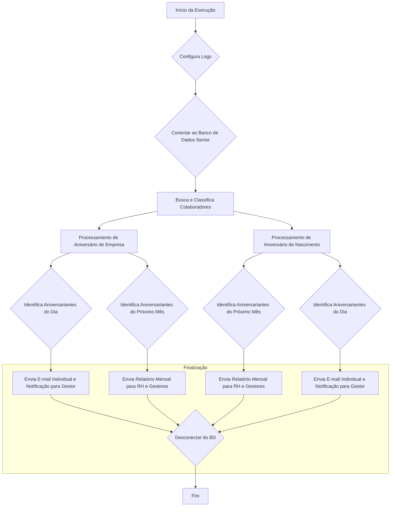
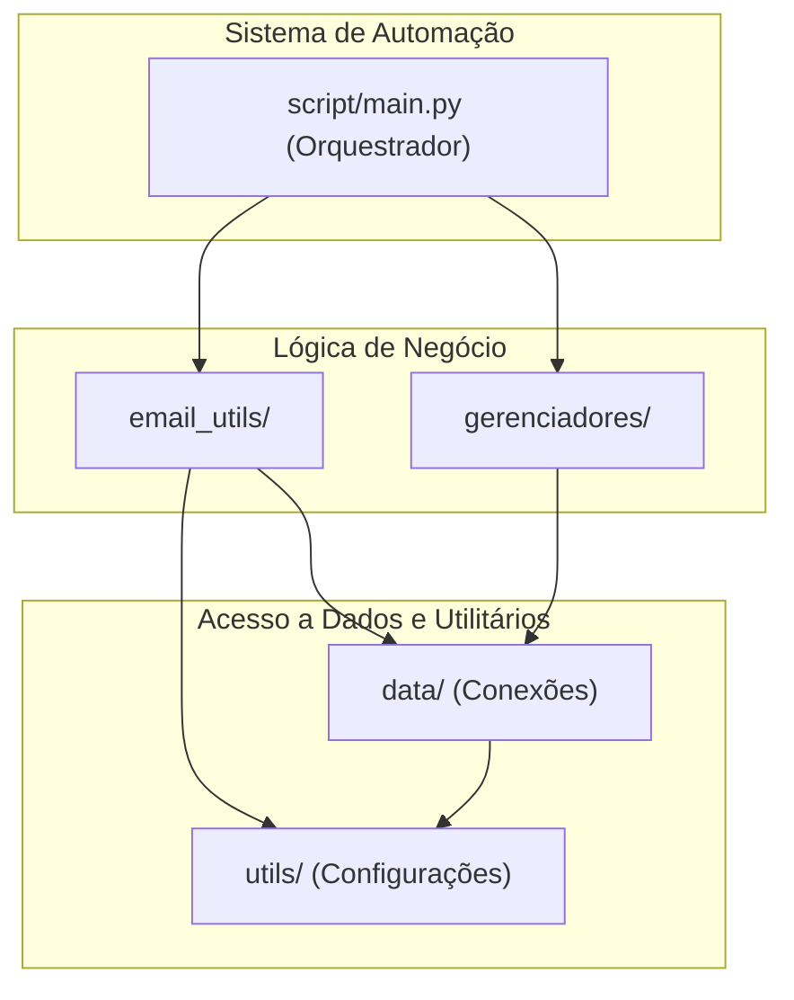

## README.md:
# Projeto de Automação de E-mails de Aniversário

## 1. Descrição
Este projeto automatiza o envio de e-mails de felicitações para colaboradores em duas ocasiões: aniversário de tempo de empresa e aniversário de nascimento. O sistema busca os dados diretamente do banco de dados da Senior, classifica os usuários, identifica os aniversariantes do dia e envia e-mails personalizados.
## 2. Funcionalidades Principais
-   **Aniversário de Tempo de Empresa:**
    -   Envia um e-mail individual para o colaborador no dia do seu aniversário de empresa.
    -   Envia um e-mail diário para o gestor com a lista de aniversariantes da sua equipe.
    -   Envia um relatório mensal para o RH com todos os aniversariantes do próximo mês.
-   **Aniversário de Nascimento:**
    -   Envia um e-mail com uma imagem personalizada para o colaborador no dia do seu aniversário.
-   **Classificação Inteligente:** Filtra e processa apenas usuários ativos e com dados válidos.
-   **Configurável:** O ambiente (teste ou produção) e as credenciais são gerenciados por variáveis de ambiente.

## 3. Arquitetura do Projeto


---


---
## 4. Pré-requisitos
-   Python 3.9 ou superior
-   Acesso ao banco de dados Oracle da Senior
-   Credenciais da API do Microsoft Graph com permissão para enviar e-mails

## 5. Instalação e Configuração
**Passo 1: Clonar o repositório**
```bash
git clone <URL_DO_SEU_REPOSITORIO>
cd <NOME_DO_PROJETO>
```

**Passo 2: Criar um ambiente virtual (recomendado)**
```bash
python -m venv venv
source venv/bin/activate  # No Windows: venv\Scripts\activate
```

**Passo 3: Instalar as dependências**
Crie um arquivo `requirements.txt` com o comando `pip freeze > requirements.txt` e adicione-o ao seu repositório.
```bash
pip install -r requirements.txt
```

**Passo 4: Configurar as variáveis de ambiente**
Renomeie o arquivo `.env.example` para `.env` e preencha todas as variáveis necessárias:

-   `host_senior`, `port_senior`, `service_name_senior`, `user_senior`, `password_senior`: Credenciais do banco de dados Senior.
-   `TENANT_ID`, `CLIENT_ID`, `CLIENT_SECRET`, `USER_MAIL`: Credenciais da API do Microsoft Graph.
-   `PICTUREBIRTH`, `LINKREDIRECT`: URLs para a imagem e o link do e-mail de aniversário.
-   `AMBIENTE`: Defina como `QAS` (teste) ou `PRD` (produção).

## 6. Como Executar
Para executar o script, utilize o seguinte comando a partir da raiz do projeto:

```bash
python src/script/main.py
```

Recomenda-se agendar a execução deste comando para rodar diariamente através de uma ferramenta como o Agendador de Tarefas do Windows ou o Cron do Linux.

---